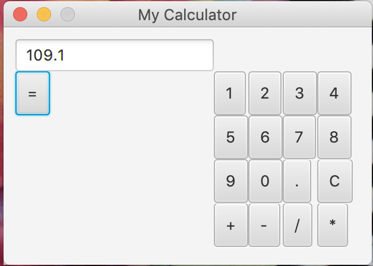

# Java-Calculator
I made a calculator with buttons and a text field using JavaFX.

Using JavaFX, I was able to get the user's input (with buttons) and render it onto a text field at the top of the calculator.
Then I used ScriptEngineManager to evaluate the string expression (example "10 + 10") into an integer or float expression.

